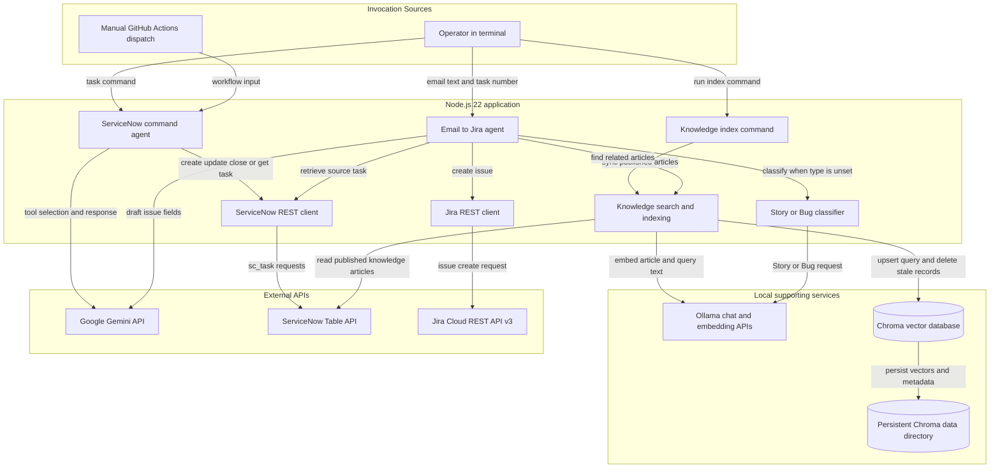
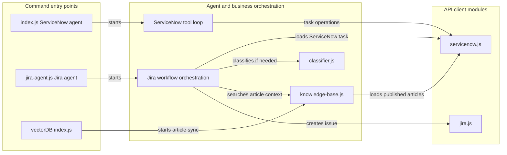

# Architecture Diagram

This application is a set of Node.js command-line agents rather than a single long-running web service. It has a ServiceNow task-management flow and a separate email-to-Jira flow, with a local Ollama and Chroma knowledge-retrieval pipeline supporting Jira issue creation.

## Application Architecture

<!-- mermaid-checked: no \n, no em-dash/en-dash, no {} in labels, subgraphs are id["label"], arrows are -->|"label"|, all subgraphs closed by end, ids unique -->

### Technology Stack Summary

| Layer | Technology | Version | Purpose |
|---|---|---|---|
| Runtime | Node.js, ECMAScript modules | Node.js 22 or later | Runs both agents and the indexing command |
| ServiceNow agent | Node.js built-in `fetch` | Included with Node.js | Sends natural-language task intent to Gemini and executes selected ServiceNow actions |
| Jira agent | Node.js built-in `fetch` | Included with Node.js | Retrieves task context, drafts issue content, and creates Jira issues |
| LLM | Google Gemini API | Model defaults to `gemini-3.8-flash` | Selects ServiceNow tools and drafts Jira summary and description |
| Local LLM | Ollama | Model defaults to `llama3.2:3b` | Classifies Jira requests as Story or Bug |
| Embeddings | Ollama | Model defaults to `nomic-embed-text` | Converts knowledge articles and search queries into vectors |
| Vector database client | npm `chromadb` | Declared as `^3.0.0` | Connects the Node.js application to the Chroma server |
| Vector database server | Chroma | Python package; not pinned in project manifests | Persists and searches knowledge-article vectors |
| ServiceNow integration | ServiceNow Table API | API path `/api/now/table` | Reads and writes Catalog Tasks and reads published Knowledge articles |
| Jira integration | Jira Cloud REST API | API v3 | Creates Story or Bug issues |
| CI entry point | GitHub Actions | Workflow uses `actions/checkout@v4` and `actions/setup-node@v4` | Manually runs the ServiceNow agent with repository secrets |

### Data Storage & External Services

ServiceNow is the system of record for Catalog Tasks and Knowledge articles. Chroma is a local persistent vector database stored under `agent/vectorDB/chroma-data`; it contains article documents, metadata, and embeddings to support similarity search. Ollama supplies local chat classification and embedding generation. Gemini provides the ServiceNow agent's tool selection and the Jira issue draft, while Jira Cloud receives the final issue creation request. The application does not define a separate application-owned relational database.

### Key Architectural Decisions

- The application is split into independent command-line entry points for ServiceNow task operations, Jira issue creation, and Knowledge article indexing.
- The Jira workflow uses retrieval-augmented context: it retrieves matching Knowledge articles from Chroma and combines them with email and ServiceNow task data before drafting an issue.
- Chroma persistence is local and self-managed; the indexing command synchronizes published ServiceNow articles into the vector collection.

## Component Relationships

The component view focuses on relationships between the repository's internal modules. External APIs and local services are shown in the application architecture above.

<!-- mermaid-checked: no \n, no em-dash/en-dash, no {} in labels, subgraphs are id["label"], arrows are -->|"label"|, all subgraphs closed by end, ids unique -->

### Component Inventory

| Component | Layer | Type | Responsibility |
|---|---|---|---|
| `index.js` | Entry points | CLI entry point | Reads `USER_COMMAND` and runs the ServiceNow Gemini tool-calling loop |
| ServiceNow tool loop | Orchestration | Agent | Maps Gemini function calls to task operations and returns results for a final response |
| `jira-agent.js` | Entry points and orchestration | CLI and exported workflow function | Collects email and task input, retrieves context, optionally classifies, drafts, then delegates issue creation |
| `classifier.js` | Orchestration | Ollama adapter | Requests and validates a `Story` or `Bug` classification |
| `knowledge-base.js` | Data access and retrieval | Chroma and embedding adapter | Synchronizes ServiceNow articles and performs vector similarity search |
| `vectorDB/index.js` | Entry points | CLI entry point | Runs a Knowledge article synchronization and reports the indexed count |
| `servicenow.js` | API adapters | ServiceNow Table API client | Implements Catalog Task CRUD-style operations and published Knowledge article retrieval |
| `jira.js` | API adapters | Jira REST API client | Converts descriptions to Atlassian Document Format and creates Jira issues |
